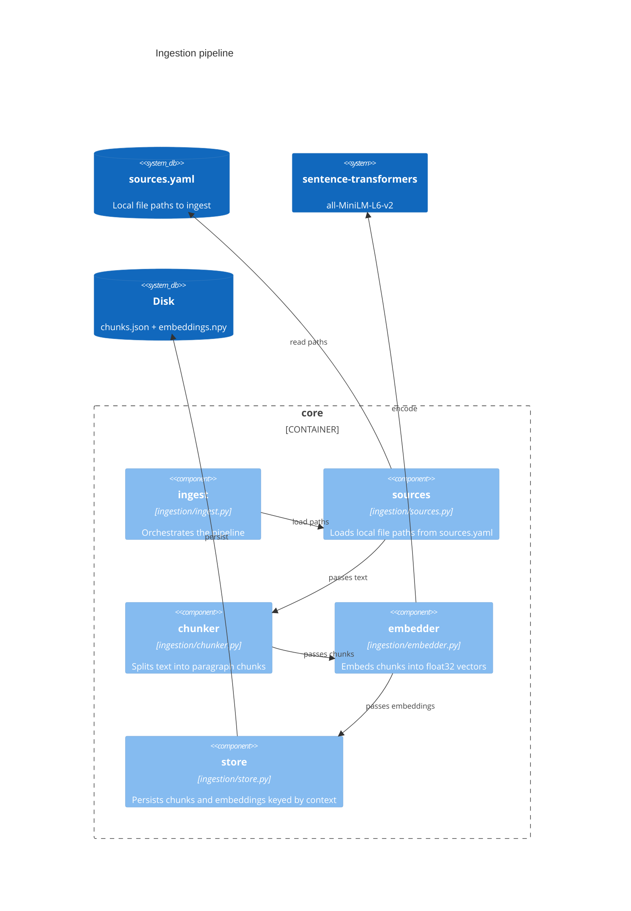
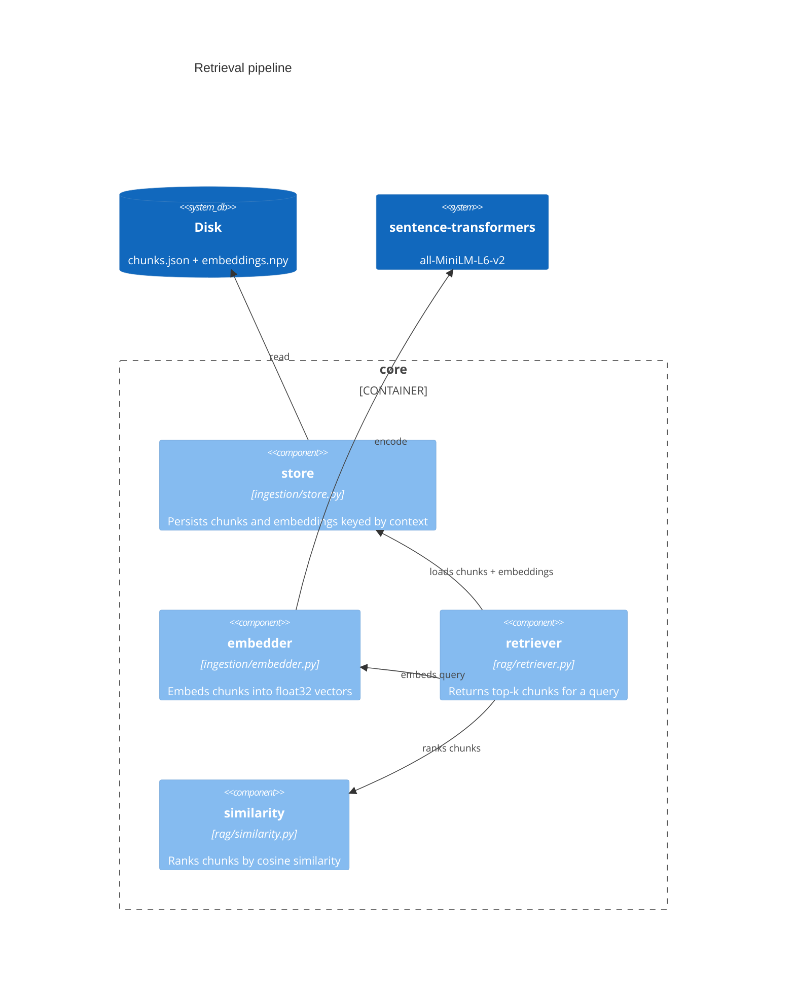

# learning-tool

A domain-agnostic personalised learning tool. The tool doesn't know what you're
learning — you plug in a context (knowledge base + learner profile + config) and
it generates questions, evaluates answers, and asks follow-ups.

## Architecture





## How it's built

This is a learning-by-building project. Sometimes the more complex approach is
taken — not because it's needed, but because understanding it is the point.
The `docs/` directory captures architectural decisions, engineering conventions,
and concepts encountered along the way.

## Prerequisites

- Python 3.13+
- [uv](https://docs.astral.sh/uv/)

## Setup

```bash
uv sync
```

## Running checks

```bash
uv run ruff check .
uv run ruff format --check .
uv run mypy .
uv run pytest
```
