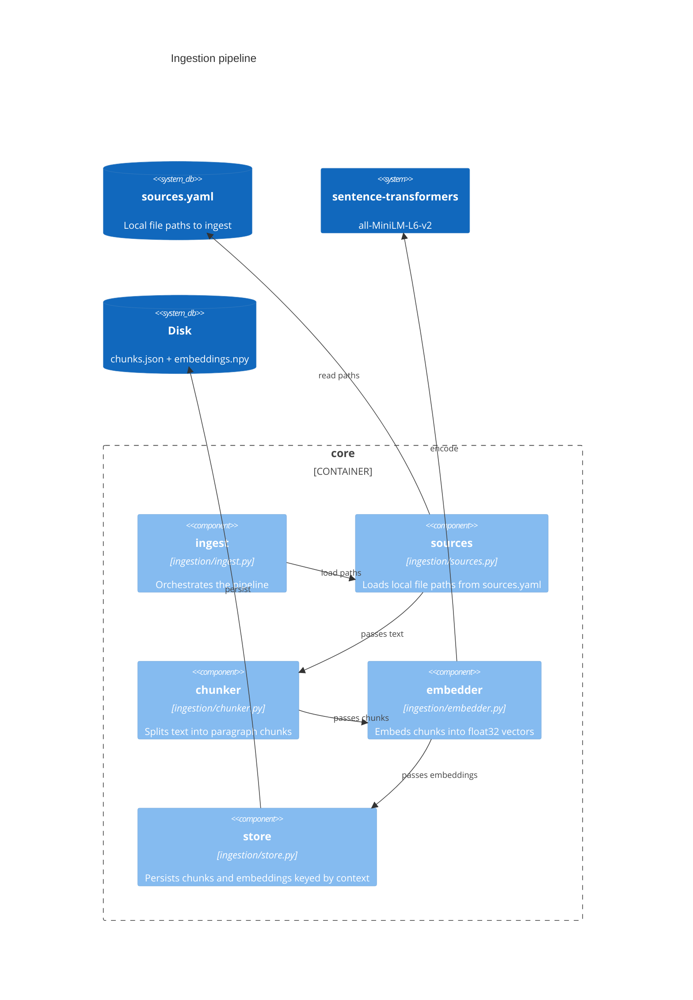
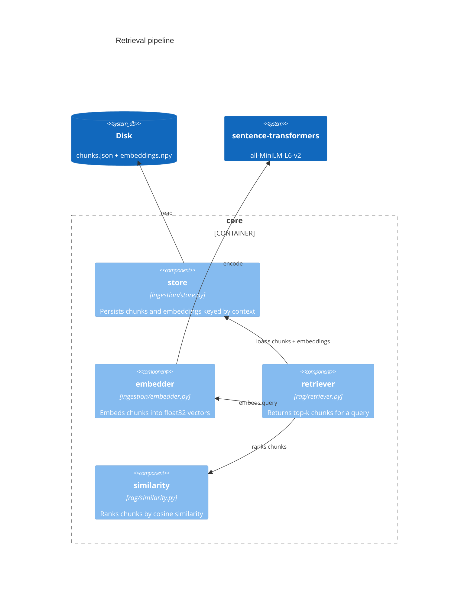

# learning-tool

A domain-agnostic personalised learning tool. The tool doesn't know what you're
learning — you plug in a context (knowledge base + learner profile + config) and
it generates questions, evaluates answers, and asks follow-ups.

## Architecture





## How it's built

This is a learning-by-building project. Sometimes the more complex approach is
taken — not because it's needed, but because understanding it is the point.
The `docs/` directory captures architectural decisions, engineering conventions,
and concepts encountered along the way.

### Capturing learnings as you build

`docs/learnings/` holds reference notes — concepts encountered while building,
with code examples. `contexts/user/` holds a learner profile — what you know
and don't yet, which drives question difficulty and how explanations are pitched.

Run `/update-notes` at the end of a Claude Code session to keep both up to date.
The command checks what was covered in the conversation, updates existing notes,
and proposes new topic files if something doesn't have a home yet.

## Prerequisites

- Python 3.13+
- [uv](https://docs.astral.sh/uv/)

## Setup

```bash
uv sync
```

## Usage

Plug in a context — a folder of documents about whatever you're learning — and the
tool generates practice questions grounded in that material.

### 1. Prepare your context

Create a directory under `contexts/` and add your learning material as text or
markdown files. `contexts/` is gitignored so your personal data stays local.

### 2. Ingest

```bash
make ingest context=<name> files=<path>
# e.g.
make ingest context=biology files=contexts/biology/notes.md
```

### 3. Generate a question

Retrieves relevant chunks and asks Claude to generate a practice question.
Requires `ANTHROPIC_API_KEY` set in your environment (copy `.env.example` to `.env`).

```bash
make question context=<name> query="<topic>"
# e.g.
make question context=biology query="what is the role of mitochondria"
```

Use `--experience-level` to tailor the question to the learner:

```bash
uv run learn question biology "what is the role of mitochondria" --experience-level beginner
```

### 4. Practice interactively

The main way to use the tool. Generates a question, prompts for your answer, evaluates it, then automatically asks the follow-up question. Continues until you decline or press Ctrl+C.

```bash
make practice context=<name> query="<topic>"
# e.g.
make practice context=biology query="mitochondria"
```

### 5. Evaluate a single answer

For one-off evaluation outside the practice loop.

```bash
make evaluate context=<name> query="<topic>" question="<question text>" answer="<answer text>"
# e.g.
make evaluate context=biology query="mitochondria" question="What is the role of mitochondria?" answer="They produce energy for the cell."
```

The output includes a score, strengths, gaps, missing points, and a suggested addition.

### 6. Inspect the prompt without calling the API

Useful for verifying retrieval quality before spending API credits:

```bash
make prompt context=<name> query="<topic>"
# e.g.
make prompt context=biology query="what is the role of mitochondria"
```

## Claude Desktop MCP setup

The MCP server lets Claude Desktop call the learning tool during a practice session.
It runs locally via stdio and communicates with the FastAPI app.

### Prerequisites

- Dependencies installed (`uv sync`)
- The FastAPI app must be running (`uv run uvicorn api.main:app`)
- Claude Desktop installed

### One-time setup

Add the following entry to Claude Desktop's `claude_desktop_config.json`:

- macOS: `~/Library/Application Support/Claude/claude_desktop_config.json`
- Windows: `%APPDATA%\Claude\claude_desktop_config.json`
- Linux: `~/.config/Claude/claude_desktop_config.json`

```json
{
  "mcpServers": {
    "learning-tool": {
      "command": "uv",
      "args": [
        "run",
        "--directory",
        "/absolute/path/to/learning-tool",
        "python",
        "adapters/mcp/server.py"
      ]
    }
  }
}
```

Replace `/absolute/path/to/learning-tool` with the absolute path to this repo on your machine.

Restart Claude Desktop after saving the config. The server starts automatically
when Claude Desktop launches.

## Database migrations

Schema changes are managed with [Alembic](https://alembic.sqlalchemy.org/en/latest/).
Migrations run automatically on startup — no manual step required.

### Making a schema change

1. Add a migration file under `alembic/versions/` — see the [Alembic tutorial](https://alembic.sqlalchemy.org/en/latest/tutorial.html) or copy `alembic/versions/001_baseline.py` as a starting point. Use `op.execute()` with raw SQL; no SQLAlchemy ORM needed.
2. Set `down_revision` to the previous revision ID and pick a new `revision` ID.
3. Write both `upgrade()` and `downgrade()`.

### Rolling back a migration

```bash
uv run alembic -x sqlalchemy.url="sqlite:///contexts/store/<context>/sessions.db" downgrade -1
```

### Verifying the current revision

```bash
sqlite3 contexts/store/<context>/sessions.db "SELECT * FROM alembic_version;"
```

## Running checks

```bash
make checks
```
