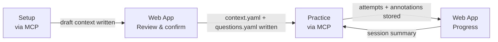
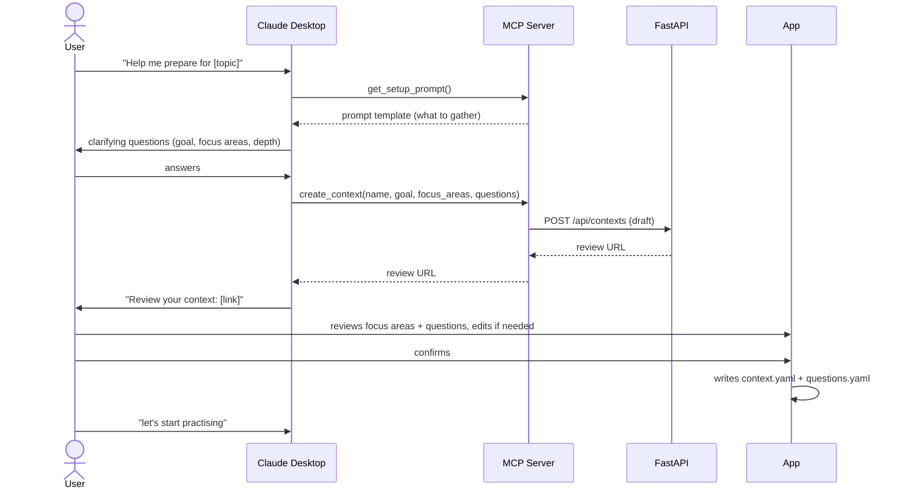
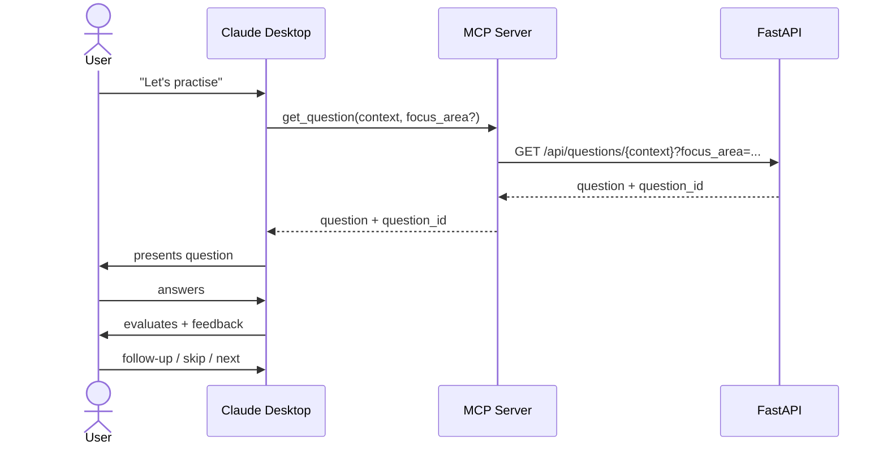
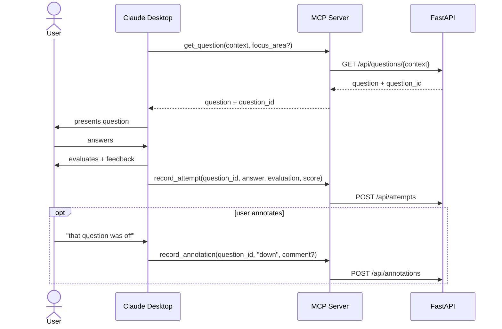

# Chat Integration — Channel-Agnostic Design

## Goal

Make the tool free to run by removing server-side LLM usage. The user's LLM chat
handles question generation and evaluation. The tool handles question serving,
session storage, and progress reporting.

## Architectural principle

The FastAPI REST API is the channel-agnostic core. Each integration is a thin
adapter that translates channel-specific calls into API requests. Core logic is
defined once.

```
Core (FastAPI REST API)
  ├── MCP server        → translates tool calls into API requests
  ├── Browser extension → calls the same API endpoints
  ├── GPT Actions       → same API endpoints, different auth
  └── Web UI            → already exists
```

Adding a new channel means writing an adapter — not touching the core.

## Full flow



## Setup — context creation via MCP



### Tools

```python
get_setup_prompt() -> str
# Returns the prompt template Claude uses to interview the user.
# Keeps prompt logic in the codebase, not hardcoded in Claude's instructions.

create_context(name: str, goal: str, focus_areas: list[str], questions: list[Question]) -> str
# Writes a draft context. Returns a review URL for the user to confirm before writing.
```

## Practice loop — Phase 1 (validate the flow)

One tool. Claude fetches a question, presents it, evaluates the answer in-context.
No recording yet.

**Validates:** does the flow feel natural? Is a question bank question enough
context for Claude to run a useful session?



### Tool

```python
get_question(context: str, focus_area: str | None = None) -> Question
```

## Practice loop — Phase 2 (record interactions)



### Tools

```python
record_attempt(question_id: str, answer: str, evaluation: str, score: int) -> None
record_annotation(question_id: str, sentiment: "up" | "down", comment: str | None = None) -> None
```

## Relationship to existing work

| Issue | Role |
|---|---|
| #142 | Non-MCP fallback — setup page for users without MCP configured |
| #143 | Non-MCP fallback — import parsed response, write context files |
| #144 | Session summary export — v1 feedback loop, no MCP needed |

#142 and #143 remain useful for first-time setup before the MCP server is
configured, but are not the primary path once MCP is in place.

## Hard-to-change decisions

| Decision | Why it matters |
|---|---|
| **`question_id` must be stable** | `record_attempt` and `record_annotation` reference it across sessions. Already addressed in #89. |
| **Context naming is shared state** | The MCP `context` param must match the web app's context directory name. Pick a convention early. |
| **API is the source of truth** | MCP tools call the API — they do not read files directly. This keeps the channel-agnostic boundary clean. |
| **MCP tool signatures** | Once users have Claude Desktop configured with these tools, changing signatures is a breaking change. Keep Phase 1 minimal. |

## Future improvements

- **Hosted MCP server** — promote from local stdio to HTTP/SSE on Railway. Requires auth (API key or user token).
- **Multi-user support** — add user identity to tool calls. Currently implicit single-user.
- **Browser extension adapter** — same API endpoints, captures interactions across any LLM chat.
- **GPT Actions adapter** — same API endpoints, for ChatGPT users.
- **`get_next_question` with spaced repetition** — weight selection by weak areas and time since last attempt.
- **`end_session()` tool** — returns a markdown digest Claude presents to the user, replacing the manual #144 export.
- **Annotation-driven tuning** — feed question sentiment into selection weighting and surface in dev review UI (#69).
- **Pre-seeded setup prompt** — `get_setup_prompt()` returns a prompt pre-filled with existing context for incremental re-imports.
