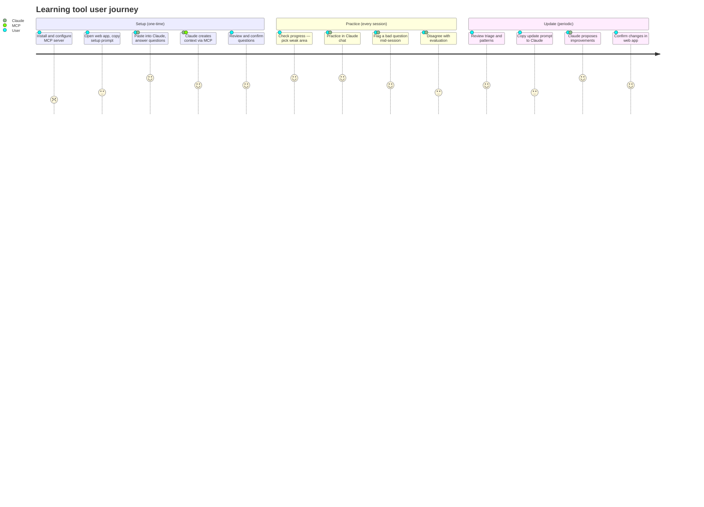
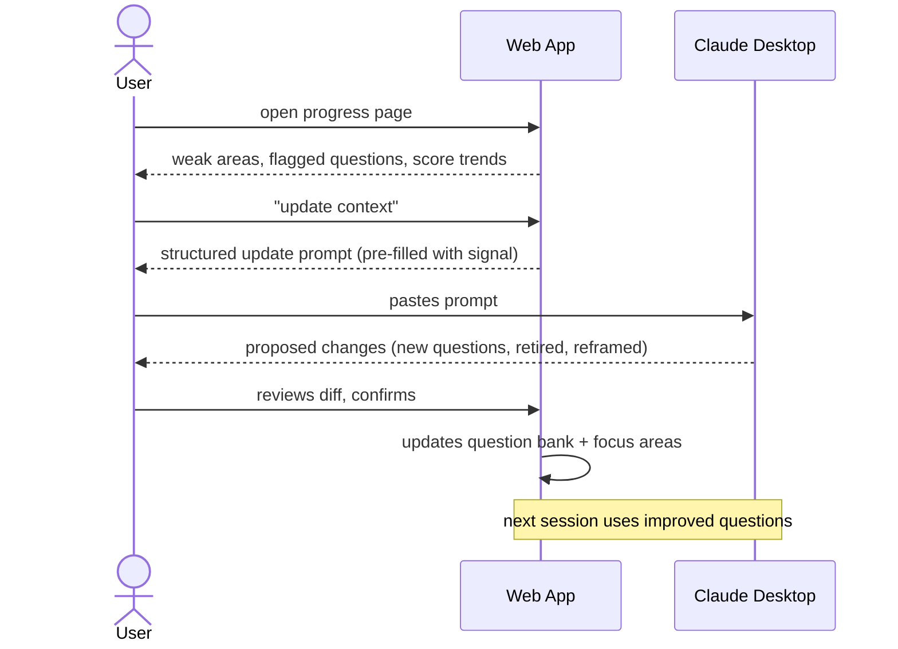
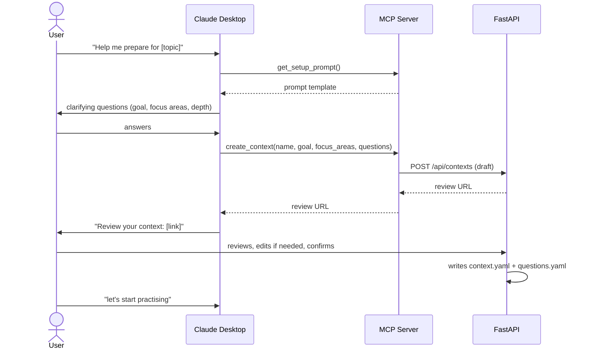
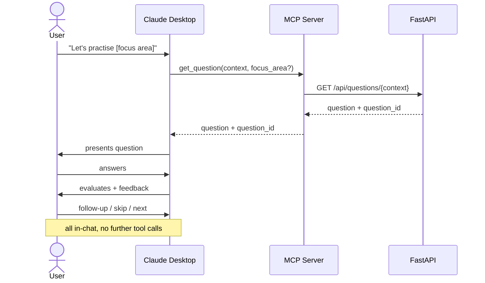
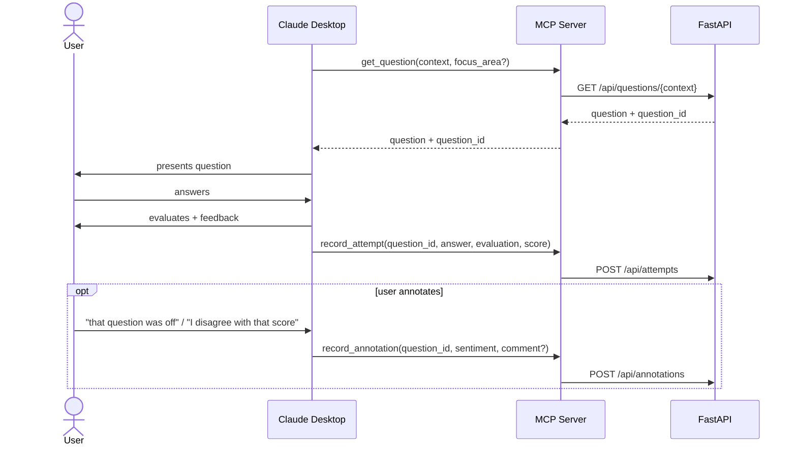

# Chat Integration — Channel-Agnostic Design

## Value proposition

> You've already built context in your Claude Project — your CV, study notes, trusted
> resources. This tool adds the practice loop, progress tracking, and evals layer on
> top, without asking you to rebuild your context elsewhere. Each session feeds back
> in, so questions get better and evaluations get sharper over time.

Claude Projects have memory but no structure. This tool provides the structured
persistence layer Claude can't — across sessions, with signal it can reason over.

---

## Architectural principle

The FastAPI REST API is the channel-agnostic core. Each integration is a thin
adapter that translates channel-specific calls into API requests. Core logic is
defined once.

```
Core (FastAPI REST API)
  ├── MCP server        → translates tool calls into API requests
  ├── Browser extension → calls the same API endpoints  (future)
  ├── GPT Actions       → same API endpoints             (future)
  └── Web UI            → already exists
```

Adding a new channel means writing an adapter — not touching the core.

---

## User stories

**Setup**
- As a user, I want to set up a learning context from my Claude chat so I don't have to rebuild my context in a new tool
- As a user, I want to review and edit generated questions before they go into my practice bank
- As a user, I want to update my question bank as I progress, without starting from scratch

**Practice**
- As a user, I want to practice in my Claude chat using my existing context
- As a user, I want to flag a question as bad or skip it during practice without breaking my flow
- As a user, I want to disagree with an evaluation so that signal is captured

**Progress**
- As a user, I want to see which focus areas I'm weak in so I know what to practice next
- As a user, I want to see my scores improving over time so I know I'm getting closer to ready
- As a user, I want to export structured feedback to Claude so future sessions are better

---

## User journey

Numbers are satisfaction scores (1 = painful, 5 = delightful) — low scores flag where the design should focus.



The two lowest-scoring steps (MCP install, copy-paste round-trips) are the primary friction points. Both improve as deployment matures — see Deployment & Distribution.

---

## Pages

### 1. Setup / Import (`/ui/{context}/setup`)

Entry point for new and returning users.

**New context:**
- Copyable prompt template — user pastes into Claude, Claude interviews them (goal, focus areas, questions)
- Claude calls `create_context()` via MCP → app writes draft, returns review URL
- User lands on review screen: focus areas and questions grouped, editable before confirming
- On confirm: `context.yaml` + `questions.yaml` written

**Existing context (update mode):**
- Same page, different state — shows current context summary and collected signal (weak areas, flagged questions, score trends)
- Copyable update prompt pre-filled with that signal
- User takes to Claude, gets proposed changes
- Returns, reviews diff (new questions, retired questions, updated focus areas)
- On confirm: question bank updated

*Note: if the two modes become confusing as the UI grows, split into separate pages.*

### 2. Progress / Readiness (`/ui/{context}/progress`)

The between-sessions touchpoint. Answers: **am I ready?**

- Coverage map — focus areas with score distribution and attempt count
- Line chart — scores over time per focus area
- Weak area callouts — "you've attempted this 8 times, avg score 5.2/10"
- Suggested next focus area based on lowest scores and longest time since last attempt
- "Update context" button — triggers the update flow with collected signal pre-filled

### 3. Practice (`/ui/{context}`)

Existing web practice loop — fallback for users without MCP configured. Unchanged.

### 4. Triage (`/ui/{context}/triage`)

Surfaces questions with multiple negative signals for action.

- Questions flagged at import, skipped during practice, or where evaluation was disputed
- Per-question: attempt history, score trend, all annotations across the three capture points
- Actions: edit question text, retire, add a note
- Questions with signal across all three annotation points ranked highest

### 5. Session detail (`/ui/{context}/sessions/{id}`)

Drill into a specific session.

- Each question attempted: answer, evaluation, score, annotation
- Already partially exists via the history page

---

## Annotation capture points

| When | How | Signal |
|---|---|---|
| **Import** | Web app review screen | Question quality before practice — edit, remove, flag |
| **During practice** | `record_annotation` MCP tool | In-the-moment — skip, "dumb question", thumbs |
| **Post-evaluation** | `record_annotation` MCP tool | Agreement with LLM judgment — disagree, "good feedback" |

Patterns across all three points drive triage ranking and the update prompt.

---

## Feedback loop



The structured signal passed to Claude:

```
Focus area: distributed systems
Questions attempted: 8 | Avg score: 6.2/10
Flagged: 2 (user disagreed with evaluation framing)
Skipped: 1 ("too theoretical")
Pattern: strong on concepts, gaps on operational trade-offs

Suggested actions:
- Retire Q#12 (flagged at import + skipped in practice)
- Add questions on operational trade-offs
- Reframe evaluation rubric for open-ended design questions
```

Claude reads this and adjusts — harder operational questions, retires flagged ones,
reframes evaluations. The richer the structure, the more useful it is as LLM input.

---

## MCP tools

### Setup

```python
get_setup_prompt() -> str
# Returns the prompt template Claude uses to interview the user.
# Keeps prompt logic in the codebase, not hardcoded in Claude's instructions.

get_update_prompt(context: str) -> str
# Returns a prompt pre-filled with collected signal — weak areas, flagged questions,
# score trends. For updating an existing context rather than starting from scratch.

create_context(name: str, goal: str, focus_areas: list[str], questions: list[Question]) -> str
# Writes a draft context. Returns a review URL — user confirms before writing.
```

### Practice loop

```python
get_question(context: str, focus_area: str | None = None) -> Question
# Returns a question from the bank for Claude to present.

record_attempt(question_id: str, answer: str, evaluation: str, score: int) -> None
# Records the user's answer and Claude's evaluation after each question.

record_annotation(question_id: str, sentiment: "up" | "down", comment: str | None = None) -> None
# Records user feedback — mid-session flag, skip, or post-evaluation disagreement.
```

Start with `get_question` only to validate the flow feels natural. Add `record_attempt`
and `record_annotation` once the basic loop works.

---

## Sequences

### Setup via MCP



### Practice loop (MVP — question serving only)



### Practice loop (full — with recording)



---

## Deployment & distribution

The tool stays in Python. A Go or Rust rewrite was considered for native binary
distribution but rejected — the existing Python codebase demonstrates the right
skills for the FDE context, and the distribution problem is better solved through
deployment than a rewrite.

### Local (current)

```
User machine:
  ├── FastAPI app    (uv run ...)
  └── MCP server     (configured in claude_desktop_config.json)
```

User needs Python, uv, and a one-time JSON config edit for Claude Desktop. High friction. Good for development only.

### Deployed on Railway

```
User machine:
  └── MCP server (local script → calls Railway API)

Railway:
  └── FastAPI app (web UI + REST API)
```

Web app is a URL — no local Python needed for the web UI or progress dashboard. The MCP server is the only local piece: a small script configured in Claude Desktop once. Auth required — MCP script needs an API key to call the Railway API.

### Future: remote MCP on claude.ai

```
User machine:
  └── (nothing)

Railway:
  ├── FastAPI app
  └── MCP server (HTTP/SSE)
         ↑
    claude.ai connects via URL + API key
```

Zero local setup. Users connect to the hosted MCP server from claude.ai settings. Requires multi-user auth and data isolation. This is the zero-friction end state.

### Distribution path

| State | What user needs locally | Friction |
|---|---|---|
| Local dev | Python, uv, JSON config edit | High |
| Deployed (Claude Desktop) | JSON config edit, API key | Low |
| Deployed (remote MCP on claude.ai) | Nothing | Zero |

---

## Data privacy

| State | What is stored where | Consideration |
|---|---|---|
| Local | Everything on user's machine (SQLite, files) | No concern |
| Deployed | Practice answers, evaluations, annotations, context on Railway server | User must opt in knowingly |
| Claude Desktop | Conversation (including answers) goes to Anthropic via user's own account | User's existing relationship with Anthropic |

**Key considerations for the deployed state:**
- Context is sensitive — what company someone is interviewing for, knowledge gaps, CV-derived goals
- Clear data retention policy needed — how long is data stored, can users delete it
- Multi-user isolation — one user's data must not be accessible to another
- The MCP endpoint is a public attack surface — API key auth required

**Simplest path:** design as self-hosted first. Users deploy their own Railway instance. No shared server, no shared data. Avoids the privacy problem entirely until multi-user is properly designed.

---

## Relationship to existing work

| Issue | Role |
|---|---|
| #142 | Setup page — prompt template display and paste field |
| #143 | Import endpoint — parse response, write context files. Review screen needs extending for import-time annotation. |
| #144 | Session summary export — v1 feedback loop, no MCP needed |

#142 and #143 cover the non-MCP path and the web review step. Once MCP is in place,
`create_context()` replaces the paste step but the review screen remains.

---

## Hard-to-change decisions

| Decision | Why it matters |
|---|---|
| **`question_id` must be stable** | `record_attempt` and `record_annotation` reference it across sessions. Already addressed in #89. |
| **Context naming is shared state** | The MCP `context` param must match the web app's context directory name. Pick a convention early. |
| **API is the source of truth** | MCP tools call the API — they do not read files directly. Keeps the channel-agnostic boundary clean. |
| **MCP tool signatures are a public contract** | Once users configure Claude Desktop, changing signatures is a breaking change. Start minimal, extend deliberately. |
| **Structured signal format** | The format passed back to Claude in the update prompt needs to be stable enough for Claude to reason over reliably. Define it early, evolve deliberately. |

---

## Future improvements

- **Multi-user support** — add user identity to tool calls. Currently implicit single-user. Required before shared hosting.
- **Split setup/update pages** — if same-page approach becomes confusing.
- **Browser extension adapter** — same API endpoints, captures interactions across any LLM chat.
- **GPT Actions adapter** — same API endpoints, for ChatGPT users.
- **`get_next_question` with spaced repetition** — weight by weak areas and recency.
- **Readiness score** — single metric derived from coverage + score trends. "You're 73% ready."
- **Annotation-driven prompt tuning** — when evaluation disagreements cluster around a question type, surface in triage and suggest prompt adjustments.
